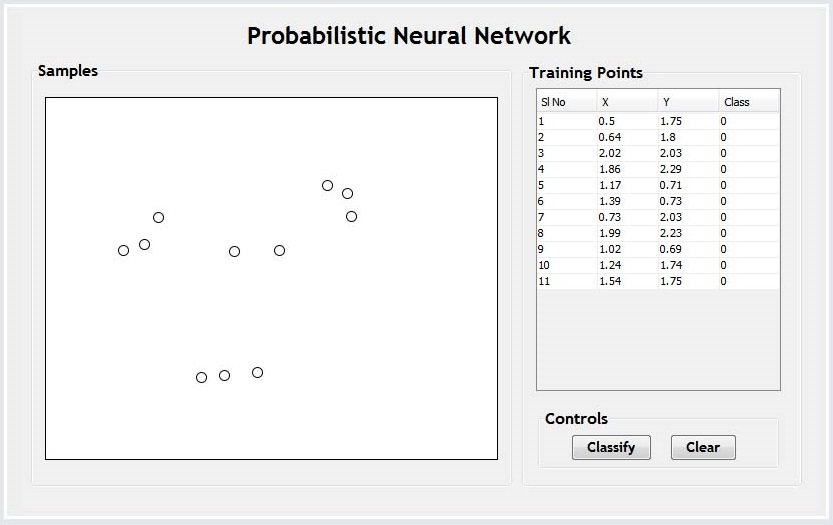
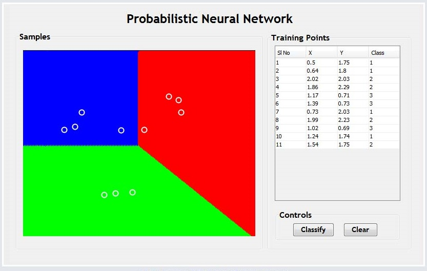
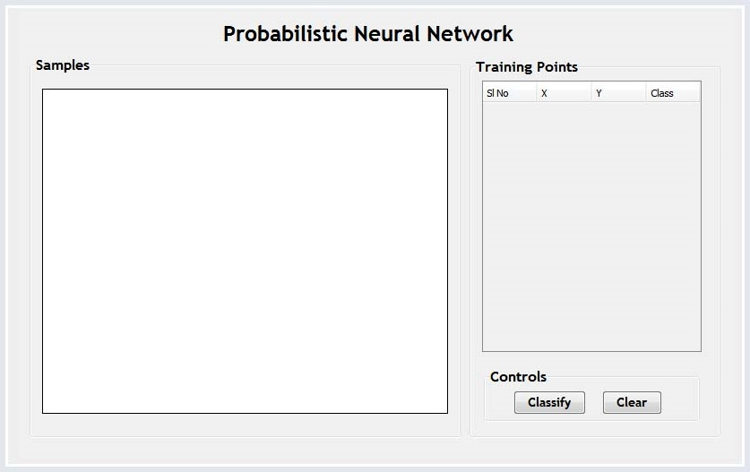

# Procedure

- Click on the board to plot the samples(upto 100 Samples).

- Click classify button to check how the PNN classifies each samples and draws the region for each class.

- Click Clear to Perform experiment again.

