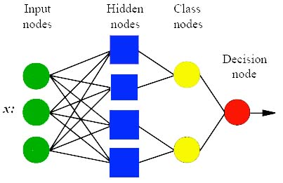

# Introduction

Probabilistic neural network (PNN) is closely related to Parzen window pdf estimator. A PNN consists of several sub-networks, each of which is a Parzen window pdf estimator for each of the classes.

The input nodes are the set of measurements.

The second layer consists of the Gaussian functions formed using the given set of data points as centers.

The third layer performs an average operation of the outputs from the second layer for each class.

The fourth layer performs a vote, selecting the largest value. The associated class label is then determined.

# Theory

***Fig. 1: PNN Structure***

- **Input Layer:** There is one neuron in the input layer for each predictor variable. In the case of categorical variables, 
N - 1  neurons are used where N is the number of categories. The input neurons (or processing before the input layer) standardizes the range of the values by subtracting the median and dividing by the interquartile range. The input neurons then feed the values to each of the neurons in the hidden layer.

- **Hidden Layer:** This layer has one neuron for each case in the training data set. The neuron stores the values of the predictor variables for the case along with the target value. When presented with the x vector of input values from the input layer, a hidden neuron computes the Euclidean distance of the test case from the neuron’s center point and then applies the RBF kernel function using the sigma value(s). The resulting value is passed to the neurons in the pattern layer.

- **Pattern Layer:** For PNN networks there is one pattern neuron for each category of the target variable. The actual target category of each training case is stored with each hidden neuron; the weighted value coming out of a hidden neuron is fed only to the pattern neuron that corresponds to the hidden neuron’s category. The pattern neurons add the values for the class they represent (hence, it is a weighted vote for that category).

- **Decision Layer:** For PNN networks, the decision layer compares the weighted votes for each target category accumulated in the pattern layer and uses the largest vote to predict the target category.